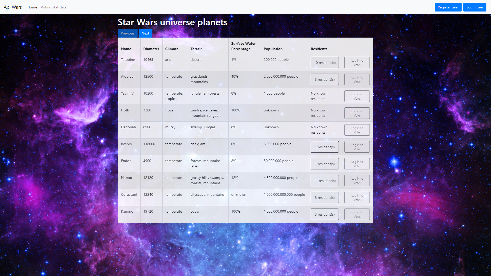

# ApiWars
## [Link to application](https://api-wars.azurewebsites.net)

Users can view data when they are not logged in, they can also register and log in. Logged in users can vote on any planet, and these votes are stored in the database. 
All users can check the current voting statistics.
Application server side is written in ASP.NET Core 3.1, I used MSSQL database and to consume and display api data I used JavaScript.

## About The Project

### Built With
This section should list any major frameworks that you built your project using. Leave any add-ons/plugins for the acknowledgements section. Here are a few examples.
* [https://swapi.dev/ - consumed api](https://swapi.dev/) 
* [ASP.NET](https://dotnet.microsoft.com/apps/aspnet)
* [Entity Framework](https://docs.microsoft.com/en-us/ef/)
* [HTML](https://www.w3.org/html/)
* [CSS](https://www.w3.org/Style/CSS/Overview.en.html)
* [JavaScript](https://developer.mozilla.org/en-US/docs/Web/JavaScript)

## Usage

As an anonymous user, you can view planet data from the Star Wars universe. In the table, you can click the Residents button to check all the residents of the planet.
You can click Voting statistics on the top left of the navbar to see the current voting statistics.
On the top right of the navbar you can click register button to create your new account. Then you can log-in.
As logged user you get prospect to vote on plantes which will be stored in database.
